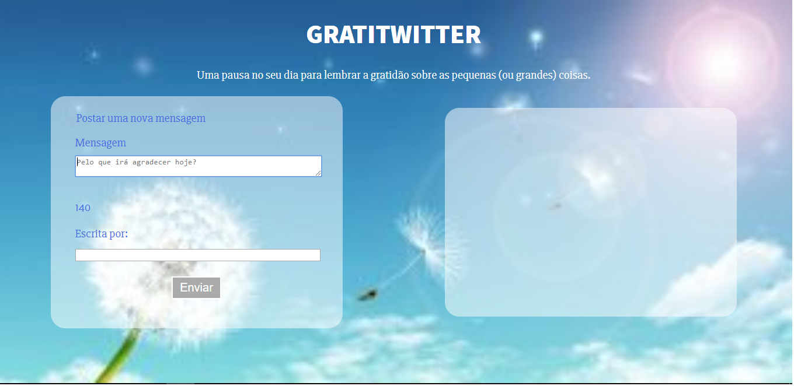

# Gratitwitter
Projeto para exercitar as criações de páginas interativas

#### Proposta :
 Criar uma página semelhante ao twitter, onde fosse possivel inserir mensagens em um campo com caracteres limitados por um contador

## Execução da Versão 0.0.1

A príncipio, desenhei como gostaria que a tela ficasse para me orientar no html;
HTTL feito, foi a vez de deixar com a aparência que gostaria, para tal, escolhi o tema "gratidão" e transformei a página em um lugar para
mandar mensagens relacionadas a esse tema e escolhi uma imagem de fundo que remetesse a isso. Em cima da imagem, trabalhei com as cores do CSS

Mas por que o CSS primeiro se ele não conta no projeto?
Justamente para não correr com ele no fim...  =)
Na verdade, boa parte dele foi reaproveitamento de outro projeto e só mudei alguns poucos tratamentos para se adequar ao tema e ele ficou assim:

Então comecei a desenvolver as funções no javascript respeitando conceitos da programação funcional.

Primeiramente, veio a função "getFromData",que pega as informações digitadas pelo usuário e as guarda em um objeto.

Segundo, a "createListItem", que cria item de lista de forma e insere as informações dentro dela.

Terceiro, a "insertNewMessage", que seleciona o paráfrago e insere a mensagem nele.

Quarta, a "insertAuthorName", que seleciona um footer e insere o nome do autor nele.

E assim todas as funcionalidades requeridas na versão 0.0.1 foram criadas.

## Execução da Versão 0.0.2

Os requerimentos dessa versão eram o bloqueio do botão ao não ter mensagem inserida e a inserção de um contador regressivo com valor de 140 para limitar os caracteres digitados.

Para desabilitar o botão de envio, foi colocado o atributo "disabled" no html e uma função no js entitulada "toggleButton" que através de condicionais verifica se o botão deve estar habilitado ou não.

Para o contador, foi criada a função "updateCounter" para decrescer a quantidade de caracteres restantes a partir de 140.

Ambas funções foram chamadas dentro da função "watchMessage" que é chamada por um "onkeyup";

No CSS, alterei a cor azul do botão de envio para um tom mais claro, e o botão desabilitado foi para cinza com o uso de uma pseudoclasse.

Visualmente, a tela passou a ser assim:

## Execução da Versão 0.0.3

O requerimento dessa versão era a mudança de cor conforme os caracteres fossem terminando, para isso foram criadas condicionais dentro da própria função do contador que mudassem as cores de acordo com o decremento dos caracteres. Ao chegar a 20 caracteres restantes, a cor do contador passa a ser amarela e a 10, vermelha. A seguir, uma imagem para ilustrar:

